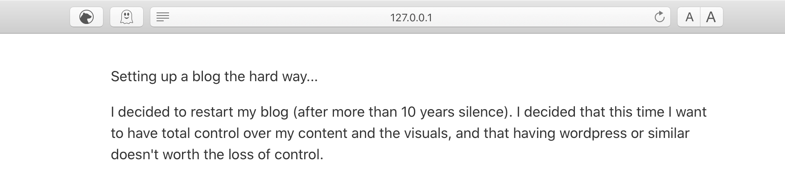

+++
date = 2020-08-08T12:00:00-03:00
title = "Blogging the hard way..."
+++

I decided to restart my blog (after more than 10 years silence). I decided that this time I want to have total control over my content and the visuals, and that having wordpress or similar doesn't worth the loss of control.

Being in ❤️LOVE❤️ with Rust for the last couple of years I looked for static website framework and settled on on [Zola](https://getzola.org).

I also found netlify to serve the blog.

First step is to create clean skeleton form the blog, simply by using zola cli:

```sh
zola init vim-zz-blog
cd vim-zz-blog
```

I also initialized a new repo on [github](https://github.com/vim-zz/vim-zz-blog.git), and pushed the new blog directory.

Then, I checked several themes, including [dinkleberg](https://github.com/rust-br/dinkleberg) and [simple-dev-blog](https://github.com/bennetthardwick/simple-dev-blog-zola-starter) but there were some issues with getting them working. 

Lesson: Zola is checking the template creation on build time. It's another evidence for Rust concepts strength: catch as much as possible on compile time rather than runtime.

Eventually I used [anpu](https://github.com/zbrox/anpu-zola-theme) which just works.

```sh
git clone --depth=1 git@github.com:zbrox/anpu-zola-theme.git themes/anpu
```

With this on the main config.toml:

```toml
theme = "anpu"

taxonomies = [
    { name = "categories" },
    { name = "tags" },
]
```

Check:
```sh
zola serve
```

Voilà!



Now all I have to do is to add files under content directory and it live loaded into [127.0.0.1:1111](http://127.0.0.1:1111)

Next, netlify it!

## Netlify

Zola is supported by netlify bu simply adding the netlify.toml file on the project root directory:

```toml
[build]
command = "zola build"
publish = "public"

[build.environment]
ZOLA_VERSION = "0.11.0"
```

Then, on netlify, just point it to my github project at https://github.com/vim-zz/vim-zz-blog.git

It's then takes you through some quick steps and you are done.

Now the nice thing is that all I need is to add stuff with my favorit editor and whenever I push to git netlify automatically updates the website. So cool 😎.